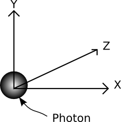
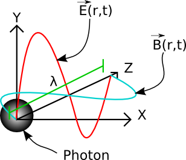
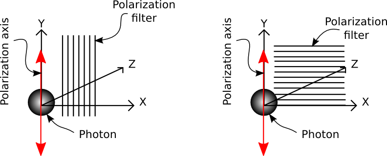
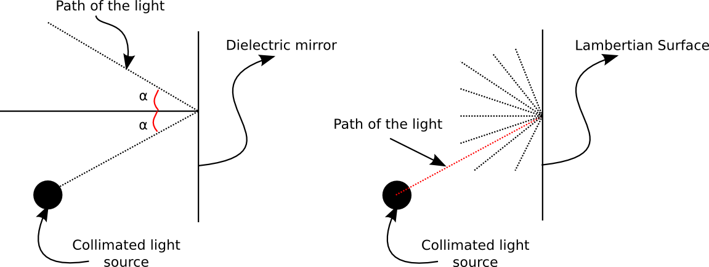

# Light, Computation, and Computational Light
We can establish an understanding of the term `Computational Light` as we explore the term `light` and its relation to `computation.`

## What is light?
Light surrounds us; we see the light and swim in the sea of light.
It is indeed a daily matter that we interact by looking out of our window to see what is outside, turning on the lights of a room, looking at our displays, taking pictures of our loved ones, walking in a night lit by moonlight, or downloading media from the internet.
Light is an eye-catching festival, reflecting, diffracting, interfering, and refracting.
Is light a wave, a ray, or a quantum-related phenomenon?
Is light heavy, or weightless?
Is light the fastest thing in this universe?
Which way does the light go?
In a more general sense, how can we use light to trigger more innovations, positively impact our lives, and unlock the mysteries of life?
We all experience light, but we must dig deep to describe it clearly.

In this introduction, my first intention here is to establish some basic scientific knowledge about light, which will help us understand why it is essential for the future of technology, especially computing.
Note that we will cover more details of light as we make progress through different chapters of this course.
But let's get this starting with the following statement.
Light is electromagnetic radiation, often described as a bundle of photons, a term first coined by Gilbert Lewis in 1926.

??? question end "Where can I learn more about electric and magnetic fields?"
    Beware that the topic of electric and magnetic fields deserves a stand-alone course and has many details to explore.
    As an undergraduate student, back in the day, I learned about electric and magnetic fields by following a dedicated class and reading this book: `Cheng, David Keun. "Fundamentals of engineering electromagnetics." (1993).`

??? question end "What is a photon?"
    Let me adjust this question a bit: `What model is good for describing a photon?`
    There is literature describing a photon as a single particle, and works show photons as a pack of particles.
     Suppose you want a more profound understanding than stating that it is a particle.
    In that case, you may want to dive deep into existing models in relation to the relativity concept: `Roychoudhuri, C., Kracklauer, A. F., & Creath, K. (Eds.). (2017). The nature of light: What is a photon?. CRC Press.`

??? question end "Where can I learn more about history of research on light?"
    There is a website showing noticeable people researching on light since ancient times and their contributions to the research on light.
    To reach out to this website to get a crash course, click [here](https://photonterrace.net/en/photon/history/).

Let me highlight that for anything to be electromagnetic, it must have electric and magnetic fields.
Let us start with this simple drawing to explain the characteristics of this electromagnetic radiation, light.
Note that this figure depicts a photon at the origin of XYZ axes.
But bear in mind that a photon's shape, weight, and characteristics are yet to be fully discovered and remain an open research question.
Beware that the figure depicts a photon as a sphere to provide ease of understanding.
_It does not mean that photons are spheres._

<figure markdown>
  { width="300" }
  <figcaption>A sketch showing XYZ axes and a photon depicted as a sphere.</figcaption>
</figure>

Let us imagine that our photon is traveling in the direction of the Z axes (notice $\vec{r}$, the direction vector).
Let us also imagine that this photon has an electric field, $\vec{E}(r,t)$ oscillating along the Y axes.
Typically this electric field is a sinusoidal oscillation following the equation, 
$$
\vec{E}(r,t) = A cos(wt),
$$
where $A$ is the amplitude of light, $t$ is the time, $\vec{r}$ is the propagation direction, $w$ is equal to $2\pi f$ and $f$ represents the frequency of light.

<figure markdown>
  { width="300" }
  <figcaption>A sketch highligting electric and magnetic fields of light.</figcaption>
</figure>

A period of this sinusoidal oscillation, $\vec{E}(r, t)$, describes **wavelength of light**, $\lambda$.
In the most simple terms, $\lambda$ is also known as the **color of light**.
As light is electromagnetic, there is one more component than $\vec{E}(r,t)$ describing light.
The next component is the magnetic field, $\vec{B}(r, t)$.
The magnetic field of light, $\vec{B}(r, t)$, is always perpendicular to the electric field of light, $\vec{E}(r, t)$ (90 degrees along XY plane).
Since only one $\lambda$ is involved in our example, we call our light monochromatic.
This light would have been polychromatic if many other $\lambda$s were superimposed to create $\vec{E}(r, t)$.
In other words, monochromatic light is a single-color light, whereas polychromatic light contains many colors.
The concept of color originated from how we sense various $\lambda$s in nature.

<figure markdown>
  { width="600" }
  <figcaption>A sketch showing electromagnetic spectrum with waves labelled in terms of their frequencies and temperatures..</figcaption>
</figure>

_But are all electromagnetic waves with various $\lambda$s considered as light?_
The short answer is that we can not call all the electromagnetic radiation light.
When we refer to light, we mainly talk about visible light, $\lambda$s that our eyes could sense.
These $\lambda$s defining visible light fall into a tiny portion of the electromagnetic spectrum shown in the above sketch.
Mainly, visible light falls into the spectrum covering wavelengths between 380 nm and 750 nm.
The tails of visible light in the electromagnetic spectrum, such as near-infrared or ultraviolet regions, could also be referred to as light in some cases (e.g., for camera designers).
In this course, although we will talk about visible light, we will also discuss the applications of these regions. 

<figure markdown>
  { width="600" }
  <figcaption>A sketch showing (left) electric and magnetic fields of light, and (right) polarization state of light.</figcaption>
</figure>

Let us revisit our photon and its electromagnetic field one more time.
As depicted in the above figure, the electric field, $\vec{E}(r, t)$, oscillates along only one axis: the Y axes.
The direction of oscillation in $\vec{E}(r, t)$ is known as **polarization** of light.
In the above example, the polarization of light is linear.
In other words, the light is linearly polarized in the vertical axis.
Note that when people talk about polarization of light, they always refer to the oscillation direction of the electric field, $\vec{E}(r, t)$.
_But are there any other polarization states of light?_
The light could be polarized in different directions along the X-axis, which would make the light polarized linearly in the horizontal axis, as depicted in the figure below on the left-hand side.
If the light has a tilted electric field, $\vec{E}(r, t)$, with components both in the X and Y axes, light could still be linearly polarized but with some angle.
However, if these two components have delays, $\phi$, in between in terms of oscillation, say one component is  $\vec{E_x}(r, t) = A_x cos(wt)$ and the other component is $\vec{E_y}(r, t) = A_y cos(wt + \phi)$, light could have a circular polarization if $A_x = A_y$.
But the light will be elliptically polarized if there is a delay, $\phi$, and $A_x \neq A_y$.
Although we do not discuss this here in detail, note that the delay of $\phi$ will help steer the light's direction in the Computer-Generated Holography chapter.

<figure markdown>
  { width="600" }
  <figcaption>A sketch showing (left) various components of polarization, and (right) a right-handed circular polarization as a sample case.</figcaption>
</figure>

There are means to filter light with a specific polarization as well.
Here, we provide a conceptual example. 
The below sketch depicts a polarization filter like a grid of lines letting the output light oscillate only in a specific direction.

<figure markdown>
  { width="600" }
  <figcaption>A sketch showing a conceptual example of linear polarization filters.</figcaption>
</figure>

We should also highlight that light could bounce off surfaces by reflecting or diffusing.
If the material is proper (e.g., dielectric mirror), the light will perfectly reflect as depicted in the sketch below on the left-hand side.
The light will perfectly diffuse at every angle if the material is proper (e.g., Lambertian diffuser), as depicted in the sketch below on the right-hand side.
Though we will discuss these features of light in the Geometric Light chapter in detail, we should also highlight that light could refract through various mediums or diffract through a tiny hole or around a corner.

<figure markdown>
  { width="600" }
  <figcaption>A sketch showing (left) light's reflection off a dielectric mirror (right) light's diffusion off a Lambertian's surface.</figcaption>
</figure>

Existing knowledge on our understanding of our universe also states that light is the fastest thing in the universe, and no other material, thing or being could exceed lightspeed ($c = 299,792,458$ metres per second).

$$
c = \lambda n f,
$$

where $n$ represents refractive index of a medium that light travels.

??? question end "Where can I find more basic information about optics and light?"
    As a graduate student, back in the day, I learned the basics of optics by reading this book without following any course: `Hecht, E. (2012). Optics. Pearson Education India.`

We have identified a bunch of different qualities of light so far.
Let us summarize what we have identified in a nutshell.

* Light is electromagnetic radiation.
* Light has electric, $\vec{E}(r,t) = A cos(wt)$, and magnetic fields, $\vec{B}(r,t)$, that are always perpendicular to each other.
* Light has color, also known as wavelength, $\lambda$.
* When we say light, we typically refer to the color we can see, visible light (390 - 750 nm).
* The oscillation axis of light's electric field is light's polarization.
* Light could have various brightness levels, the so-called amplitude of light, $A$.
* Light's polarization could be at various states with different $A$s and $\phi$s.
* Light could interfere by accumulating delays, $\phi$, and this could help change the direction of light.
* Light could reflect off the surfaces.
* Light could refract as it changes the medium.
* Light could diffract around the corners.
* Light is the fastest thing in our universe.

Remember that the description of light provided in this chapter is simplistic, missing many important details.
The reason is to provide an entry and a crash course at first glance is obvious.
We will deep dive into focused topics in the following chapters.
This way, you will be ready with a conceptual understanding of light.

??? tip end "Did you know?"
    Did you know there is an international light day every 16th of May recognized by the United Nations Educational, Scientific and Cultural Organization (UNESCO)? 
    For more details, click [here](https://www.unesco.org/en/days/light)

## What is Computational Light?
Computational light is a term that brings the concepts in computational methods with the characteristics of light.
In other words, wherever we can program the qualities of light, this will get us into the topics of computational light.
Programming light may sound unconventional, but I invite you to consider how we program current computers.
These conventional computers interpret voltage levels in an electric signal as ones and zeros.
Color, $\lambda$, propagation direction, $\vec{r}$, amplitude, $A$, phase, $\phi$, polarization, diffraction, and interference are all qualities that could help us program light to achieve tasks for specific applications.
There are enormous amounts of applications of light.
Let us glance at some of the important ones to get a sense of possibilities for people studying the topics of computational light.
For each topic highlighted below, please click on the box to discover more about that specific subfield of computational light.

??? success end "Computer Graphics"
    Computer Graphics deals with generating synthetic images using computers and simulations of light.
    Common examples of Computer Graphics are the video games we all play and are familiar with.
    In today's world, you can often find Computer Graphics as a tool to simulate and synthesize scenes for developing a trending topic, artificial intelligence.
    
    * **Noticeable profiles.** Like in any field, there are noticeable people in this field that you may want to observe their profiles to get a sense of who they are, what they achieve, or what they built for the development of modern Computer Graphics.
    Here are some people I would encourage you to explore their websites: [Peter Shirley](https://www.petershirley.com/), and [Morgan Mcguire](https://casual-effects.com/).
    * **Successful products.** Here are a few examples of successful outcomes from the field of Computer Graphics: [Roblox](https://www.roblox.com/), [NVIDIA's DLSS](https://www.nvidia.com/en-gb/geforce/technologies/dlss/), [Apple's Metal](https://developer.apple.com/metal/), [OpenGL](https://www.opengl.org/) and [Vulkan](https://www.vulkan.org/).
    * **Did you know?** The lecturer of the Computational Light Course, [Kaan Akşit](https://kaanaksit.com), is actively researching topics of Computer Graphics (e.g., [Beyond blur: Real-time ventral metamers for foveated rendering](https://kaanaksit.com/assets/pdf/WaltonEtAl_SIGGRAPH2021_Beyond_blur_real_time_ventral_metamers_for_foveated_rendering.pdf)).
    * **Want to learn more?** Although we will cover a great deal of Computer Graphics in this course, you may want to dig deeper with a dedicated course, which you can follow online:
    
<iframe width="560" height="315" src="https://www.youtube.com/embed/-LqUu61oRdk" title="YouTube video player" frameborder="0" allow="accelerometer; autoplay; clipboard-write; encrypted-media; gyroscope; picture-in-picture; web-share" allowfullscreen></iframe>

??? success end "Computational Displays"
    Computational Displays topic deals with inventing next-generation display technology for the future of human-computer interaction.
    Common examples of emerging Computational Displays are near-eye displays such as Virtual Reality headsets and Augmented Reality Glasses.
    Today, we all use displays as a core component for any visual task, such as working, entertainment, education, and many more.

    * **Noticeable profiles.** Like in any field, there are noticeable people in this field that you may want to observe their profiles to get a sense of who they are, what they achieve, or what they built for the development of Computational Displays.
    Here are some examples of such people; I would encourage you to explore their websites: [Rafał Mantiuk](https://www.cl.cam.ac.uk/~rkm38/), and [Andrew Maimone](https://www.cs.unc.edu/~maimone/).
    * **Successful products.** Here are a few examples of successful outcomes from the field of Computational Displays: [Nreal Augmented Reality glasses](https://www.nreal.ai/) and [Meta Quest Virtual Reality headsets](https://www.oculus.com/experiences/quest/).
    * **Did you know?** The lecturer of the Computational Light Course, [Kaan Akşit](https://kaanaksit.com), is actively researching topics of Computational Displays (e.g., [Near-Eye Varifocal Augmented Reality Display using See-Through Screens](https://kaanaksit.com/assets/pdf/AksitEtAl_SiggraphAsia2017_Near_eye_varifocal_augmented_reality_display_using_see_through_screens.pdf)).
    Kaan has made noticeable contributions to three-dimensional displays, virtual reality headsets, and augmented reality glasses.
    * **Want to learn more?** Although we will cover a great deal of Computational Displays in this course, you may want to dig deeper with a dedicated course, which you can follow online:
    
 <iframe width="560" height="315" src="https://www.youtube.com/embed/z_AtSgct6_I" title="YouTube video player" frameborder="0" allow="accelerometer; autoplay; clipboard-write; encrypted-media; gyroscope; picture-in-picture; web-share" allowfullscreen></iframe> 

??? success end "Computational Photography"
    Computational Photography

??? success end "Computational Imaging and Sensing"
    Computational Imaging and Sensing

??? success end "Computational Optics"
    Computational Optics

??? success end "Light-based Telecommunication"
    Light-based Telecommunication

??? success end "Computational Astronomy"
    Computational Astronomy.

??? success end "Photonic Computers"
    Photonic Computers.

??? success end "All-optical Machine Learning"
    All-optical Machine Learning

??? success end "Computational Microscopy"
    Computational Microscopy.

??? success end "Optical Fabrication"
    Optical Fabrication.

Indeed, there are more topics related to computational light than the ones highlighted here.
If you are up to a challenge for the next phase of your life, you could help the field identify new opportunities with light-based sciences.
In addition, there are indeed more topics, more noticeable profiles, successful product examples, and dedicated courses that focus on every one of these topics.
Examples are not limited to the ones that I have provided above.
Your favorite search engine is your friend to find out more in this case.

!!! warning end "Reminder"
    We host a Slack group with more than 300 members.
    This Slack group focuses on the topics of rendering, perception, displays and cameras.
    The group is open to public and you can become a member by following [this link](https://complightlab.com/outreach/).
    Readers can get in-touch with the wider community using this public group.
