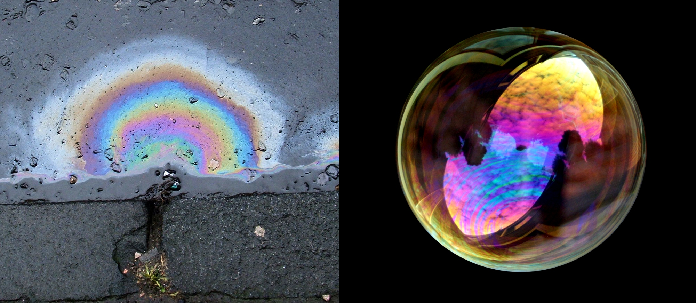
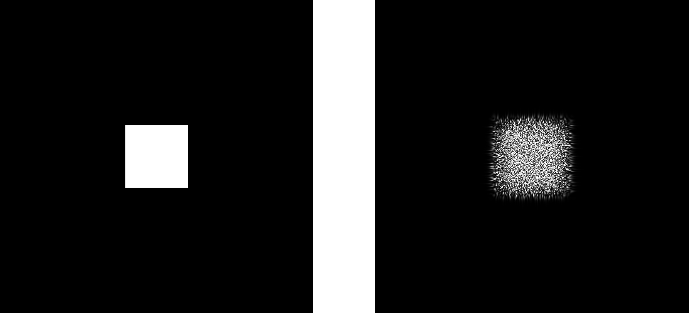
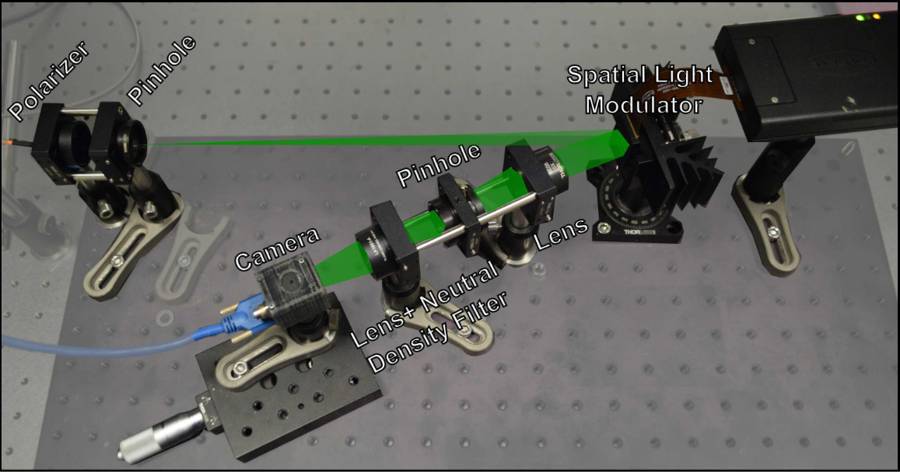
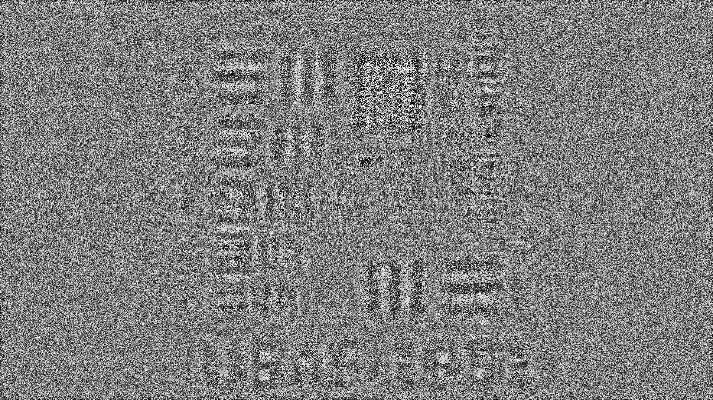
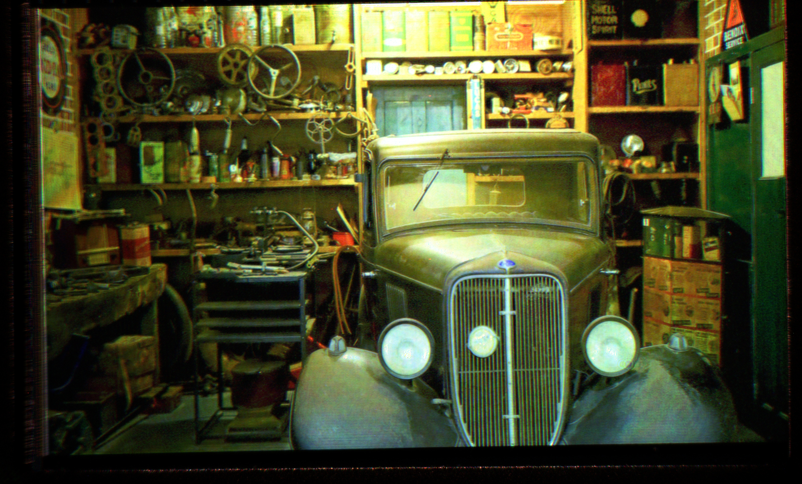
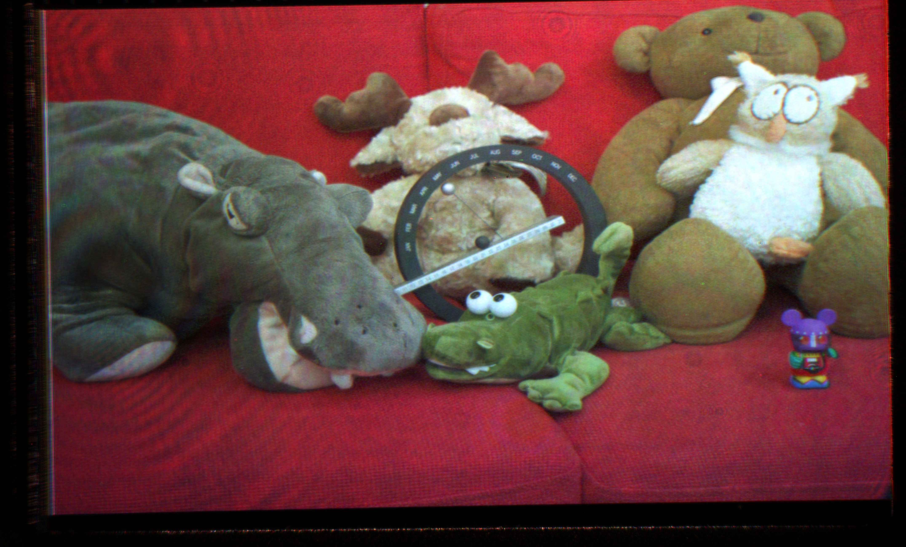
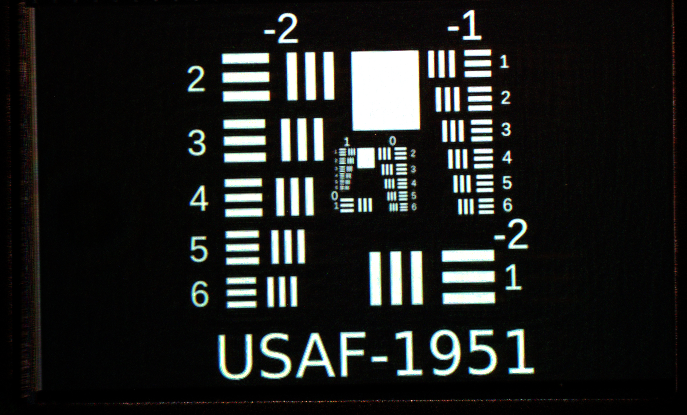
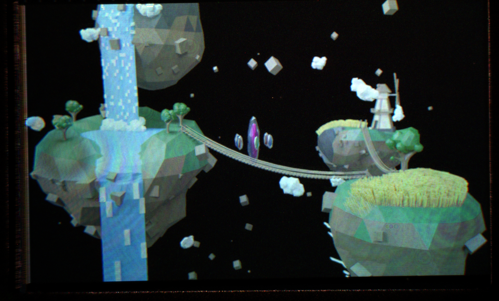
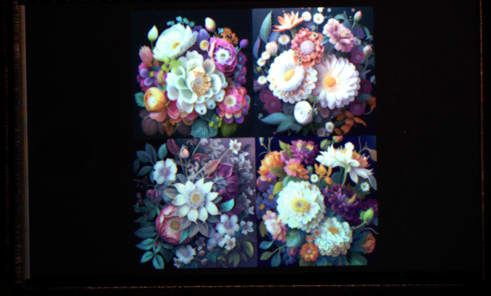
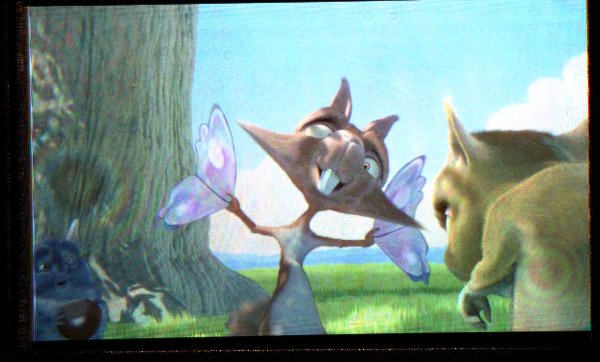

??? quote end "Narrate section"
    <audio controls="controls">
         <source type="audio/mp3" src="../media/computer_generated_holography.mp3"></source>
    </audio>


# Computer-Generated Holography


In this section, we introduce Computer-Generated Holography (CGH) [@born2013principles, @goodman2005introduction] as another emerging method to simulate light.
CGH offers an upgraded but more computationally expensive way to simulating light concerning the raytracing method described in the previous section.
This section dives deep into CGH and will explain how CGH differs from raytracing as we go.


## What is holography?


:octicons-info-24: Informative 

Holography is a method in Optical sciences to represent light distribution using amplitude and phase of light.
In much simpler terms, holography describes light distribution emitted from an object, scene, or illumination source over a surface by treating the light as a wave.
The primary difference of holography concerning raytracing is that it accounts not only amplitude or intensity of light but also the phase of light.
Unlike classical raytracing, holography also includes diffraction and interference phenomena.
In raytracing, the smallest building block that defines light is a ray, whereas, in holography, the building block is a light distribution over surfaces.
In other terms, while raytracing traces rays, holography deals with surface-to-surface light transfer.


??? tip end "Did you know this source?"
    There is an active repository on GitHub, where latest CGH papers relevant to display technologies are listed.
    Visit [GitHub:bchao1/awesome-holography](https://github.com/bchao1/awesome-holography) for more.


### What is a hologram?


:octicons-info-24: Informative 


Hologram is either a surface or a volume that modifies the light distribution of incoming light in terms of phase and amplitude.
Diffraction gratings, Holographic Optical Elements, or Metasurfaces are good examples of holograms.
Within this section, we also use the term hologram as a means to describe a lightfield or a slice of a lightfield.


### What is Computer-Generated Holography?


:octicons-info-24: Informative 


It is the computerized version (discrete sampling) of holography.
In other terms, whenever you can program the phase or amplitude of light, this will get us to Computer-Generated Holography.


??? question end "Where can I find an extensive summary on CGH?"
    You may be wondering about the greater physical details of CGH.
    In this case, we suggest our readers watch the video below.
    Please watch this video for an extensive summary on CGH [@kavakli2022optimizing].
    <center> <iframe width="560" height="315" src="https://www.youtube.com/embed/z_AtSgct6_I" title="YouTube video player" frameborder="0" allow="accelerometer; autoplay; clipboard-write; encrypted-media; gyroscope; picture-in-picture; web-share" allowfullscreen></iframe> </center>


## Defining a slice of a lightfield :material-alert-decagram:{ .mdx-pulse title="Too important!" }


:octicons-info-24: Informative ·
:octicons-beaker-24: Practical


CGH deals with generating optical fields that capture light from various scenes.
CGH often describes these optical fields (a.k.a. lightfields, holograms) as planes.
So in CGH, light travels from plane to plane, as depicted below.
Roughly, CGH deals with plane to plane interaction of light, whereas raytracing is a ray or beam oriented description of light.


<figure markdown>
  { width="600" }
  <figcaption>A rendering showing how a slice (a.k.a. lightfield, optical field, hologram) propagates from one plane to another plane.</figcaption>
</figure>


In other words, in CGH, you define everything as a "lightfield," including light sources, materials, and objects.
Thus, we must first determine how to describe the mentioned lightfield in a computer.
So that we can run CGH simulations effectively.


A lightfield is a planar slice in the context of CGH, as depicted in the above figure.
This planar field is a pixelated 2D surface (could be represented as a matrix).
The pixels in this 2D slice hold values for the amplitude of light, $A$, and the phase of the light, $\phi$ at each pixel.
Whereas in classical raytracing, a ray only holds the amplitude or intensity of light.
With a caveat, though, raytracing could also be made to care about the phase of light. 
Still, it will then arrive with all the complications of raytracing, like sampling enough rays or describing scenes accurately.


Each pixel in this planar lightfield slice encapsulates the $A$ and $\phi$ as $A cos(wt + \phi)$.
If you recall our description of light, we explain that light is an electromagnetic phenomenon.
Here, we model the oscillating electric field of light with $A cos(wt + \phi)$ shown in our previous light description.
Note that if we stick to $A cos(wt + \phi)$, each time two fields intersect, we have to deal with trigonometric conversion complexities like sampled in this example:


$$
A_0 cos(wt + \phi_0) + A_1 cos(wt + \phi_1),
$$


Where the indices zero and one indicate the first and second fields, and we have to identify the right trigonometric conversion to deal with this sum.


Instead of complicated trigonometric conversions, what people do in CGH is to rely on complex numbers as a proxy to these trigonometric conversions.
In its proxy form, a pixel value in a field is converted into $A e^{-j \phi}$, where $j$ represents a complex number ($\sqrt{-1}$).
Thus, with this new proxy representation, the same intersection problem we dealt with using sophisticated trigonometry before could be turned into something as simple as $A_0 A_1 e^{-j(\phi_0 +\phi_1)}$.


In the above summation of two fields, the resulting field follows an exact sum of the two collided fields.
On the other hand, in raytracing, often, when a ray intersects with another ray, it will be left unchanged and continue its path.
However, in the case of lightfields, they form a new field.
This feature is called interference of light, which is not introduced in raytracing, and often raytracing omits this feature.
As you can tell from also the summation, two fields could enhance the resulting field (constructive interference) by converging to a brighter intensity, or these two fields could cancel out each other (destructive interference) and lead to the absence of light --total darkness--.

There are various examples of interference in nature.
For example, the blue color of a butterfly wing results from interference, as biology typically does not produce blue-colored pigments in nature.
More examples of light interference from daily lives are provided in the figure below.


<figure markdown>
  { width="600" }
  <figcaption>Two photographs showin some examples of light interference: (left) thin oil film creates rainbow interference patterns (CC BY-SA 2.5 by Wikipedia user John) and a soup bubble interference with light and creates vivid reflections (CC BY-SA 3.0 by Wikipedia user Brocken Inaglory).</figcaption>
</figure>


We have established an easy way to describe a field with a proxy complex number form.
This way, we avoided complicated trigonometric conversions. 
Let us look into how we use that in an actual simulation.
Firstly, we can define two separate matrices to represent a field using real numbers:


```python
import torch

amplitude = torch.tensor(100, 100, dtype = torch.float64)
phase = torch.tensor(100, 100, dtype = torch.float64)
```


In this above example, we define two matrices with `100 x 100` dimensions.
Each matrix holds floating point numbers, and they are real numbers.
To convert the amplitude and phase into a field, we must define the field as suggested in our previous description.
Instead of going through the same mathematical process for every piece of our future codes, we can rely on a utility function in odak to create fields consistently and coherently across all our future developments.
The utility function we will review is `odak.learn.wave.generate_complex_field()`:


=== ":octicons-file-code-16: `odak.learn.wave.generate_complex_field`"

    ::: odak.learn.wave.generate_complex_field


Let us use this utility function to expand our previous code snippet and show how we can generate a complex field using that:


```python
import torch
import odak # (1)

amplitude = torch.tensor(100, 100, dtype = torch.float64)
phase = torch.tensor(100, 100, dtype = torch.float64)
field = odak.learn.wave.generate_complex_field(amplitude, phase) # (2)
```

1. Adding `odak` to our imports.
2. Generating a field using `odak.learn.wave.generate_complex_field`.


## Propagating a field in free space :material-alert-decagram:{ .mdx-pulse title="Too important!" }


:octicons-info-24: Informative ·
:octicons-beaker-24: Practical


The next question we have to ask is related to the field we generated in our previous example.
In raytracing, we propagate rays in space, whereas in CGH, we propagate a field described over a surface onto another target surface.
So we need a transfer function that projects our field on another target surface.
That is the point where free space beam propagation comes into play.
As the name implies, free space beam propagation deals with propagating light in free space from one surface to another.
This entire process of propagation is also referred to as light transport in the domains of Computer Graphics.
In the rest of this section, we will explore means to simulate beam propagation on a computer.


??? tip end "A good news for Matlab fans!"
    We will indeed use `odak` to explore beam propagation.
    However, there is also a book in the literature, `[Numerical simulation of optical wave propagation: With examples in MATLAB by Jason D. Schmidt](https://www.spiedigitallibrary.org/ebooks/PM/Numerical-Simulation-of-Optical-Wave-Propagation-with-Examples-in-MATLAB/eISBN-9780819483270/10.1117/3.866274?SSO=1)`[@schmidt2010numerical], that provides a crash course on beam propagation using MATLAB.


As we revisit the field we generated in the previous subsection, we remember that our field is a pixelated 2D surface.
Each pixel in our fields, either a hologram or image plane, typically has a small size of a few micrometers (e.g., $8 \mu m$).
How light travels from each one of these pixels on one surface to pixels on another is conceptually depicted as a figure at the beginning of this section (green wolf image with two planes).
We will name that figure's first plane on the left as the hologram plane and the second as the image plane.
In a nutshell, the contribution of a pixel on a hologram plane could be calculated by drawing rays to every pixel on the image plane.
We draw rays from a point to a plane because in wave theory --what CGH follows--, light can diffract (a small aperture creating spherical waves as Huygens suggested).
Each ray will have a certain distance, thus causing various delays in phase $\phi$.
As long as the distance between planes is large enough, each ray will maintain an electric field that is in the same direction as the others (same polarization), thus able to interfere with other rays emerging from other pixels in a hologram plane.
This simplified description oversimplifies solving the [Maxwell equations in electromagnetics](http://hyperphysics.phy-astr.gsu.edu/hbase/electric/maxeq.html).

A simplified result of solving Maxwell's equation is commonly described using Rayleigh-Sommerfeld diffraction integrals. 
For more on Rayleigh-Sommerfeld, consult [`Heurtley, J. C. (1973). Scalar Rayleigh–Sommerfeld and Kirchhoff diffraction integrals: a comparison of exact evaluations for axial points. JOSA, 63(8), 1003-1008.`](https://doi.org/10.1364/JOSA.63.001003) [@heurtley1973scalar].
The first solution of the Rayleigh-Sommerfeld integral, also known as the Huygens-Fresnel principle, is expressed as follows:

$$
u(x,y)=\frac{1}{j\lambda} \int\!\!\!\!\int u_0(x,y)\frac{e^{jkr}}{r}cos(\theta)dxdy,
$$

where the field at a target image plane, $u(x,y)$, is calculated by integrating over every point of the hologram's area, $u_0(x,y)$.
Note that, for the above equation, $r$ represents the optical path between a selected point over a hologram and a selected point in the image plane, theta represents the angle between these two points, k represents the wavenumber ($\frac{2\pi}{\lambda}$) and $\lambda$ represents the wavelength of light.
In this described light transport model, optical fields, $u_0(x,y)$ and $u(x,y)$, are represented with a complex value,

$$
u_0(x,y)=A(x,y)e^{j\phi(x,y)},
$$

where $A$ represents the spatial distribution of amplitude and $\phi$ represents the spatial distribution of phase across a hologram plane.
The described holographic light transport model is often simplified into a single convolution with a fixed spatially invariant complex kernel, $h(x,y)$ [@sypek1995light].

$$
u(x,y)=u_0(x,y) * h(x,y) =\mathcal{F}^{-1}(\mathcal{F}(u_0(x,y)) \mathcal{F}(h(x,y))).
$$


There are multiple variants of this simplified approach:

* [`Matsushima, Kyoji, and Tomoyoshi Shimobaba. "Band-limited angular spectrum method for numerical simulation of free-space propagation in far and near fields." Optics express 17.22 (2009): 19662-19673.`](https://doi.org/10.1364/OE.17.019662) [@matsushima2009band],
* [`Zhang, Wenhui, Hao Zhang, and Guofan Jin. "Band-extended angular spectrum method for accurate diffraction calculation in a wide propagation range." Optics letters 45.6 (2020): 1543-1546.`](https://doi.org/10.1364/OL.385553) [@zhang2020band],
* [`Zhang, Wenhui, Hao Zhang, and Guofan Jin. "Adaptive-sampling angular spectrum method with full utilization of space-bandwidth product." Optics Letters 45.16 (2020): 4416-4419.`](https://doi.org/10.1364/OL.393111) [@zhang2020adaptive].


In many cases, people choose to use the most common form of $h(x, y)$ described as

$$
h(x,y)=\frac{e^{jkz}}{j\lambda z} e^{\frac{jk}{2z} (x^2+y^2)},
$$

where z represents the distance between a hologram plane and a target image plane.
Note that beam propagation can also be learned for physical setups to avoid imperfections in a setup and to improve the image quality at an image plane:


* [`Peng, Yifan, et al. "Neural holography with camera-in-the-loop training." ACM Transactions on Graphics (TOG) 39.6 (2020): 1-14.`](https://doi.org/10.1145/3414685.3417802) [@peng2020neural],
* [`Chakravarthula, Praneeth, et al. "Learned hardware-in-the-loop phase retrieval for holographic near-eye displays." ACM Transactions on Graphics (TOG) 39.6 (2020): 1-18.`](https://doi.org/10.1145/3414685.3417846) [@chakravarthula2020learned],
* [`Kavaklı, Koray, Hakan Urey, and Kaan Akşit. "Learned holographic light transport." Applied Optics (2021).`](https://doi.org/10.1364/AO.439401) [@kavakli2022learned].


The above descriptions establish a mathematical understanding of beam propagation.
Let us examine the implementation of a beam propagation method called `Bandlimited Angular Spectrum` by reviewing these two utility functions from `odak`:

=== ":octicons-file-code-16: `odak.learn.wave.get_band_limited_angular_spectrum_kernel`"

    ::: odak.learn.wave.get_band_limited_angular_spectrum_kernel

=== ":octicons-file-code-16: `odak.learn.wave.band_limited_angular_spectrum`"

    ::: odak.learn.wave.band_limited_angular_spectrum

=== ":octicons-file-code-16: `odak.learn.wave.propagate_beam`"

    ::: odak.learn.wave.propagate_beam

=== ":octicons-file-code-16: `odak.learn.wave.wavenumber`"

    ::: odak.learn.wave.wavenumber


Let us see how we can use the given beam propagation function with an example:


=== ":octicons-file-code-16: `test_learn_wave_beam_propagation.py`"


    ```python 
    --8<-- "test/test_learn_wave_beam_propagation.py"
    ```


    1. Setting the wavelength of light in meters. We use 532 nm (green light) in this example.
    2. Setting the physical size of a single pixel in our simulation. We use $6 \mu m$ pixel size (width and height are both $6 \mu m$.) 
    3. Setting the distance between two planes, hologram and image plane. We set it as half a centimeterhere.
    4. We set the propagation type to `Bandlimited Angular Spectrum`.
    5. Here, we calculate a value named wavenumber, which we introduced while we were talking about the beam propagation functions.
    6. Here, we assume that there is a rectangular light at the center of our hologram.
    7. Here, we generate the field by combining amplitude and phase. 
    8. Here, we zeropad and crop our field before and after the beam propagation to make sure that there is no aliasing in our results (see Nyquist criterion).
    9. We propagate the beam using the values and field provided.
    10. We calculate the final intensity on our image plane. Remember that human eyes can see intensity but not amplitude or phase of light. Intensity of light is a square of its amplitude.
    11. We save image plane intensity to an image file.
    12. For comparison, we also save the hologram intensity to an image file so that we can observe how our light transformed from one plane to another.


Let us also take a look at the saved images as a result of the above sample code:


<figure markdown>
  { width="600" }
  <figcaption>Saved intensities before (left_ and after (right) beam propagation (hologram and image plane intensities). This result is generated using "test/test_learn_beam_propagation.py".</figcaption>
</figure>


??? abstract end "[Challenge: Light transport on Arbitrary Surfaces](https://github.com/kaanaksit/odak/discussions/76)"
    We know that we can propagate a hologram to any image plane at any distance.
    This propagation is a plane-to-plane interaction.
    However, there may be cases where a simulation involves finding light distribution over an arbitrary surface.
    Conventionally, this could be achieved by propagating the hologram to multiple different planes and picking the results from each plane on the surface of that arbitrary surface.
    We challenge our readers to code the mentioned baseline (multiple planes for arbitrary surfaces) and ask them to develop a beam propagation that is less computationally expensive and works for arbitrary surfaces (e.g., tilted planes or arbitrary shapes).
    This development could either rely on classical approaches or involve learning-based methods.
    The resultant method could be part of `odak.learn.wave` submodule as a new class `odak.learn.wave.propagate_arbitrary`.
    In addition, a unit test `test/test_learn_propagate_arbitrary.py` has to adopt this new class.
    To add these to `odak,` you can rely on the `pull request` feature on GitHub.
    You can also create a new `engineering note` for arbitrary surfaces in `docs/notes/beam_propagation_arbitrary_surfaces.md`.


## Optimizing holograms


:octicons-info-24: Informative ·
:octicons-beaker-24: Practical


In the previous subsection, we propagate an input field (a.k.a. lightfield, hologram) to another plane called the image plane.
We can store any scene or object as a field on such planes.
Thus, we have learned that we can have a plane (hologram) to capture or display a slice of a lightfield for any given scene or object.
After all this introduction, it is also safe to say, regardless of hardware, **holograms are the natural way to represent three-dimensional scenes, objects, and data!**


Holograms come in many forms.
We can broadly classify holograms as analog and digital.
Analog holograms are physically tailored structures.
They are typically a result of manufacturing engineered surfaces (micron or nanoscale structures).
Some examples of analog holograms include diffractive optical elements [@swanson1989binary], holographic optical elements [@kogelnik1969coupled], and metasurfaces [@huang2018metasurface].
Here, we show an example of an analog hologram that gives us a slice of a lightfield, and we can observe the scene this way from various perspectives:


<figure markdown>
  { width="600" }
  <figcaption>A video showing analog hologram example from <a href="https://www.youtube.com/watch?v=nhgzWFos6m8">Zebra Imaging -- ZScape</a>.</figcaption>
</figure>


Digital holograms are the ones that are dynamic and generated using programmable versions of analog holograms.
Typically, the tiniest fraction of digital holograms is a pixel that either manipulates the phase or amplitude of light.
In [our laboratory](https://complightlab.com), we build holographic displays [@kavakli2023realistic, @kavakli2022learned], a programmable device to display holograms.
The components used in such a display are illustrated in the following rendering and contain a Spatial Light Modulator (SLM) that could display programmable holograms.
Note that the SLM in this specific hardware can only manipulate phase of an incoming light.


<figure markdown>
  { width="600" }
  <figcaption>A rendering showing a standard holographic display hardware.</figcaption>
</figure>


We can display holograms that generate images to fill a three-dimensional volume using the above hardware.
We know that they are three-dimensional from the fact that we can focus on different parts of the images by changing the focus of our camera (closely observing the camera's location in the above figure).
Let us look into a sample result to see what these three-dimensional images look like as we focus on different scene parts.


<figure markdown>
  { width="600" }
  <figcaption>A series of photographs at various focuses capturing images from <a href="https://complightlab.com/publications/realistic_defocus_cgh/">our computer-generated holograms</a>.</figcaption>
</figure>


Let us look into how we can optimize a hologram for our holographic display by visiting the below example:


=== ":octicons-file-code-16: `test_learn_wave_stochastic_gradient_descent.py`"


    ```python 
    --8<-- "test/test_learn_wave_stochastic_gradient_descent.py"
    ```
    
    1. Replace `cpu` with `cuda` if you have a NVIDIA GPU with enough memory or AMD GPU with enough memory and ROCm support.
    2. We will provide the details of this optimization function in the next part.
    3. Saving the phase-only hologram. Note that a phase-only hologram is between zero and two pi.
    4. Loading an image from a file with 1920 by 1080 resolution and using green channel.


The above sample optimization script uses a function called `odak.learn.wave.stochastic_gradient_descent`.
This function sits at the center of this optimization, and we have to understand what it entails by closely observing its inputs, outputs, and source code.
Let us review the function.


=== ":octicons-file-code-16: `odak.learn.wave.stochastic_gradient_descent`"

    ::: odak.learn.wave.stochastic_gradient_descent

Let us also examine the optimized hologram and the image that the hologram reconstructed at the image plane.


<figure markdown>
  { width="600" }
  <figcaption>Optimized phase-only hologram. Generated using "test/test_learn_wave_stochastic_gradient_descent.py".</figcaption>
</figure>

<figure markdown>
  { width="600" }
  <figcaption>Optimized phase-only hologram reconstructed at the image plane, generated using "test/test_learn_wave_stochastic_gradient_descent.py".</figcaption>
</figure>


??? abstract end "[Challenge: Non-iterative Learned Hologram Calculation](https://github.com/kaanaksit/odak/discussions/77)"
    We provided an overview of optimizing holograms using iterative methods.
    Iterative methods are computationally expensive and unsuitable for real-time hologram generation.
    We challenge our readers to derive a learned hologram generation method for multiplane images (not single-plane like in our example).
    This development could either rely on classical convolutional neural networks or blend with physical priors explained in this section.
    The resultant method could be part of `odak.learn.wave` submodule as a new class `odak.learn.wave.learned_hologram`.
    In addition, a unit test `test/test_learn_hologram.py` has to adopt this new class.
    To add these to `odak,` you can rely on the `pull request` feature on GitHub.
    You can also create a new `engineering note` for arbitrary surfaces in `docs/notes/learned_hologram_generation.md`.


## Simulating a standard holographic display :material-alert-decagram:{ .mdx-pulse title="Too important!" }


:octicons-info-24: Informative ·
:octicons-beaker-24: Practical


We optimized holograms for a holographic display in the previous section.
However, the beam propagation distance we used in our optimization example was large.
If we were to run the same optimization for a shorter propagation distance, say not cms but mms, we would not get a decent solution.
Because in an actual holographic display, there is an aperture that helps to filter out some of the light.
The previous section contained an optical layout rendering of a holographic display, where this aperture is also depicted.
As depicted in the rendering located in the previous section, this aperture is located between a two lens system, which is also known as 4F imaging system.


??? tip end "Did you know?"
    4F imaging system can take a Fourier transform of an input field by using physics but not computers.
    For more details, please review [these course notes from MIT](https://ocw.mit.edu/courses/2-71-optics-spring-2009/1f37d811580bb5d181f7d51877e4e5ea_MIT2_71S09_lec19.pdf).


Let us review the class dedicated to accurately simulating a holographic display and its functions:


=== ":octicons-file-code-16: `odak.learn.wave.holographic_display.reconstruct`"

    ::: odak.learn.wave.holographic_display.reconstruct


=== ":octicons-file-code-16: `odak.learn.wave.holographic_display.forward`"

    ::: odak.learn.wave.holographic_display.forward


This sample unit test provides an example use case of the holographic display class.


=== ":octicons-file-code-16: `test_learn_wave_holographic_display.py`"

    ```python 
    --8<-- "test/test_learn_wave_holographic_display.py"
    ```

Let us also examine how the reconstructed images look like at the image plane.


<figure markdown>
  { width="800" }
  <figcaption>Reconstructed phase-only hologram at two image plane, generated using "test/test_learn_wave_holographic_display.py".</figcaption>
</figure>


You may also be curious about how these holograms would look like in an actual holographic display, here we provide a sample gallery filled with photographs captured from our holographic display:


<figure markdown>
  { width="400", align=left }
  { width="400", align=left }
  { width="400", align=left }
  { width="400", align=left }
  { width="400", align=left }
  { width="400", align=left }
  { width="400", align=left }
  { width="400", align=left }
  <figcaption>Photographs of holograms captured using the holographic display in <a href="https://complightlab.com">Computational Light Laboratory</a></figcaption>
</figure>


## Conclusion


:octicons-info-24: Informative


Holography offers new frontiers as an emerging method in simulating light for various applications, including displays and cameras.
We provide a basic introduction to Computer-Generated Holography and a simple understanding of holographic methods.
A motivated reader could scale up from this knowledge to advance concepts in displays, cameras, visual perception, optical computing, and many other light-based applications.


!!! warning end "Reminder"
    We host a Slack group with more than 300 members.
    This Slack group focuses on the topics of rendering, perception, displays and cameras.
    The group is open to public and you can become a member by following [this link](https://complightlab.com/outreach/).
    Readers can get in-touch with the wider community using this public group.
